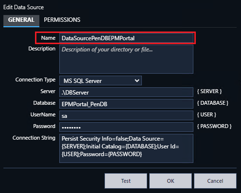
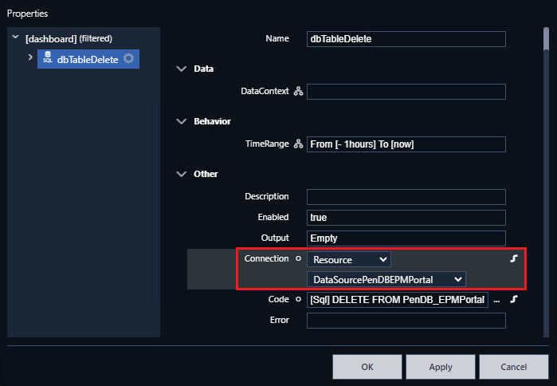

# Exemplo de gráfico dinâmico utilizando somente recursos do EPM Portal.

Este é um exemplo de dashboard que executa configurações dinâmicas de visualização utilizando exclusivamente recursos do EPM Portal (não utiliza EPM Processor) e armazenamento das configurações no SQL.
Tendo como recursos disponibilizados no exemplo:
-	Criação, edição e carregamento de grupos de visualização de penas públicos e privados;
- Permite armazenar e carregar o período de consulta utilizado;
- Permite adição e remoção de coleções de medidas.

## Configuração:
1.	Restaure a tabela dentro do banco de dados e o dashboard do EPM Portal;
2.	Na área de administração do EPM Portal, crie a configuração com o banco de dados, exemplo:

3.	Caso não tenha utilizado o mesmo nome de conexão com o banco de dados conforme exemplo do passo 2 (DataSourcePenDBEPMPortal), é necessário reconfigurar as conexões dos DataSets SQL:
    - Acesse o dashboard;
    - Habilite o modo de edição;
    - Acesse a área de datasets;
    - Para cada dataset SQL, clique em editar e altere as configurações de edição, conforme exemplo:

5.	Continuando na área de configuração de retorno dos Paths do modelo de dados do EPM, é importante configurar o código do dataset TypeScript “searchItens” para encontrar o nível de acesso que as medidas se encontram para montagem da lista de seleção das penas, para deve-se configurar Inputs:
    - No input “rootpath”: Informar o item raiz para acesso as medidas, incluindo o nome da interface, exemplo: “/1:iE3/1:Dados”
    - No input “NivelNumber”: Informar o número de níveis a partir do “rootpath” para se localizar as medidas, neste exemplo as medidas se encontram “3” níveis abaixo do “rootpath”.

**IMPORTANTE:**

Os paths das medidas que serão plotadas no gráfico precisão seguir como padrão o exemplo: “/1:InterfaceName/1:PathModeloDados01/1:NomeMedida”.

Na versão do EPM Portal (5.50) que o exemplo foi construído, ainda não está disponível o BrowseReverso com retorno dos paths names das medidas de forma “amigável”, por isso esse recurso não foi utilizado. Para uma versão futura, recomenda-se utilizar este método, pois é possível retornar de forma mais simples e objetiva todas as medidas do modelo de dados, sem a necessidade de procurar em níveis específicos.

Caso as medidas estejam em níveis diversos do modelo, pode-se adotar duas ações atualmente nesta versão do EPM Portal:
  - Replicar o dataset de exemplo para encontrar as medidas nos demais locais, e unificar os resultados em outro dataset;
  - Editar o código Typescript para fazer esse mesmo conceito de busca em “N” níveis em um único typescript.
