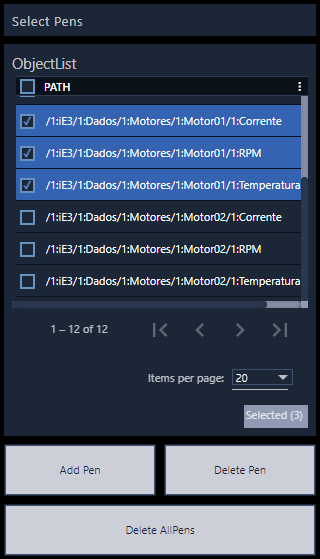
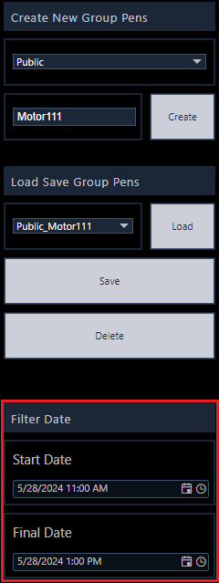

# Exemplo de gráfico dinâmico utilizando somente recursos do EPM Portal.

Este é um exemplo de dashboard que executa configurações dinâmicas de visualização utilizando exclusivamente recursos do EPM Portal (não utiliza EPM Processor) e armazenamento das configurações no SQL.
Tendo como recursos disponibilizados no exemplo:
- Criação, edição e carregamento de grupos de visualização de penas públicos e privados;
- Permite armazenar e carregar o período de consulta utilizado;
- Permite adição e remoção de coleções de medidas.

## Configuração:
1.	Baixe os arquivos da pasta files do GitHub;
2.	Restaure a tabela (sqlquery_Table_EPMPortal_PenDB) dentro do banco de dados e o dashboard do EPM Portal (DynamicChartEPMPortal);
3.	Na área de administração do EPM Portal, crie a configuração com o banco de dados, exemplo:

3.	Caso não tenha utilizado o mesmo nome de conexão com o banco de dados conforme exemplo do passo 2 (DataSourcePenDBEPMPortal), é necessário reconfigurar as conexões dos DataSets SQL:
    - Acesse o dashboard;
    - Habilite o modo de edição;
    - Acesse a área de datasets;
    - Para cada dataset SQL, clique em editar e altere as configurações de edição, conforme exemplo:

5.	Continuando na área de configuração de retorno dos Paths do modelo de dados do EPM, é importante configurar o código do dataset TypeScript “searchItens” para encontrar o nível de acesso que as medidas se encontram para montagem da lista de seleção das penas, para deve-se configurar Inputs:
    - No input “rootpath”: Informar o item raiz para acesso as medidas, incluindo o nome da interface, exemplo: “/1:iE3/1:Dados”
    - No input “NivelNumber”: Informar o número de níveis a partir do “rootpath” para se localizar as medidas, neste exemplo as medidas se encontram “3” níveis abaixo do “rootpath”.

**IMPORTANTE:**

Os paths das medidas que serão plotadas no gráfico precisão seguir como padrão o exemplo: “/1:InterfaceName/1:PathModeloDados01/1:NomeMedida”.

Na versão do EPM Portal (5.50) que o exemplo foi construído, ainda não está disponível o BrowseReverso com retorno dos paths names das medidas de forma “amigável”, por isso esse recurso não foi utilizado. Para uma versão futura, recomenda-se utilizar este método, pois é possível retornar de forma mais simples e objetiva todas as medidas do modelo de dados, sem a necessidade de procurar em níveis específicos.

Caso as medidas estejam em níveis diversos do modelo, pode-se adotar duas ações atualmente nesta versão do EPM Portal:
  - Replicar o dataset de exemplo para encontrar as medidas nos demais locais, e unificar os resultados em outro dataset;
  - Editar o código Typescript para fazer esse mesmo conceito de busca em “N” níveis em um único typescript.

# Funcionamento do Gráfico

Neste tópico é explicado como funciona as ações dentro do gráfico dinâmico do EPM Portal.

## Adicionando e removendo penas

Para adicionar é remover penas, deve-se fazer uso dos controles de penas a direta.

### Adicionar penas

Para adicionar penas, deve-se:
1. Marcar as penas desejadas no "Object List";
2. Clicar no botão "Add Pen".

### Remover penas

Para remover as penas, temos duas opções:
1. Para remover todas as penas do gráfico, devemos clicar no botão "Delete All Pens";

2. Para remover apenas determinadas penas, devemos selecionar as penas no "Object List", e depois clicar no botão "Delete Pen", desta forma as penas selecionadas na lista serão removidas.

## Grupos de penas e Filtro

Para trabalhar com a configuração do grupo de penas, e período de pesquisa, devemos utilizar os controles do lado esquerdo do dashboard.

### Filtro de pesquisa

Para configurar o filtro de pesquisa para as penas adicionadas no gráfico, deve-se selecionar as datas e horários desejados através dos controles destacados na imagem abaixo. O campo de data superior é a data inicial de pesquisa, e o campo inferior a data final.

### Criar grupo de penas

Para criar um grupo de penas e armazenas no banco de dados, precisamos realizar os seguintes passos:
1. Adicione as penas que deseja cadastrar dentro de um grupo no gráfico;
2. No canto superior esquerdo, escolha na caixa de opções, escolha o tipo de grupo que será criado (público ou privado);
3. Na caixa de texto abaixo, informa o nome do grupo de penas a ser criado;
4. Clique no botão "Create" para criar o grupo de penas. Neste momento, o grupo de penas foi criado, mas as penas ainda não foram salvas neste grupo;
5. Para salvar as penas dentro deste grupo, deve-se clicar no botão "Save" na área de carregamento de grupos de penas.

Realizando estes passos, o seu grupo de penas deve ter sido criado corretamente no banco de dados.

### Carregar grupo de penas

Para carregar o grupo de penas, deve-se:
1. Selecionar o grupo de penas na caixa de opção;
2. Clicar no botão "Load", conforme imagem.

### Deletar grupo de penas

Para deletar o grupo de penas, deve-se:
1. Selecionar o grupo de penas na caixa de opção;
2. Clicar no botão "Delete", conforme imagem.

